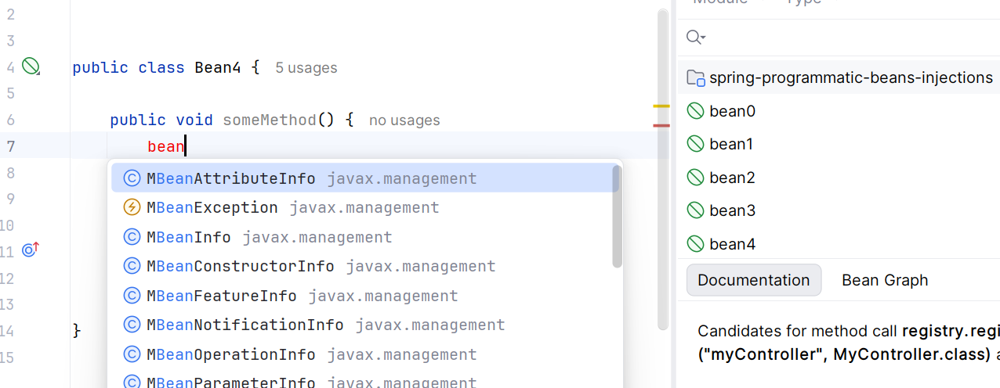
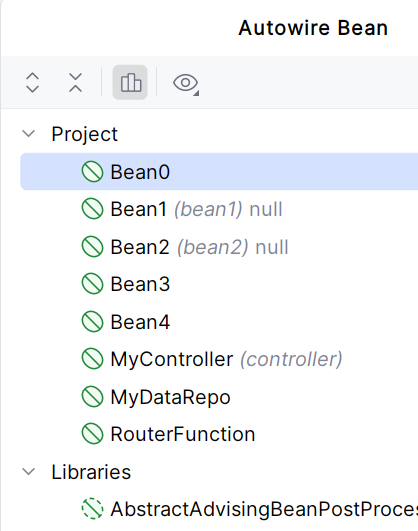
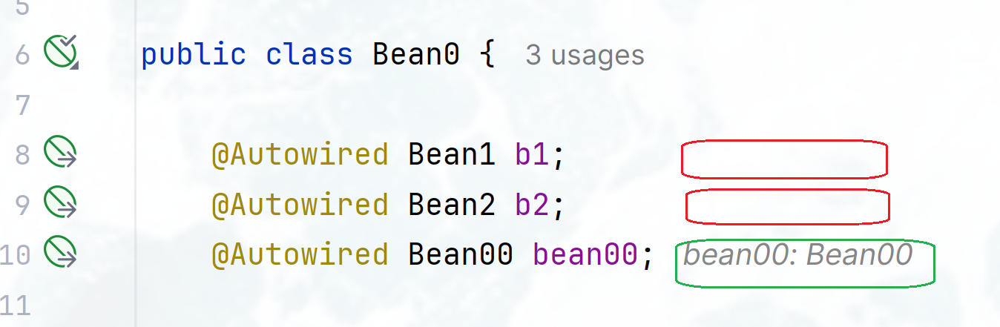

### Programmatic bean problems:

- autowiring by completion doesn't work in the programmatically registered bean classes
  
- autowiring by postfix template or quick fix don't work also
   https://youtrack.jetbrains.com/issue/IDEA-384894/Spring-programmatic-beans-registration-no-autowiring-by-completion-in-the-bean-classes
- strange 'null' labels in the AutowireBean... dialog for some beans (Bean1, Bean2)
  
   https://youtrack.jetbrains.com/issue/IDEA-384897/Spring-programmatic-beans-registration-incorrect-entries-in-the-AutowireBeans...-dialog
- debugger: no runtime inlays for the (same as above) autowired beans
  
   https://youtrack.jetbrains.com/issue/IDEA-384957/Spring-Debugger-runtime-bean-inlays-are-not-shown-for-some-programmatically-registered-beans-in-non-suspended-mode